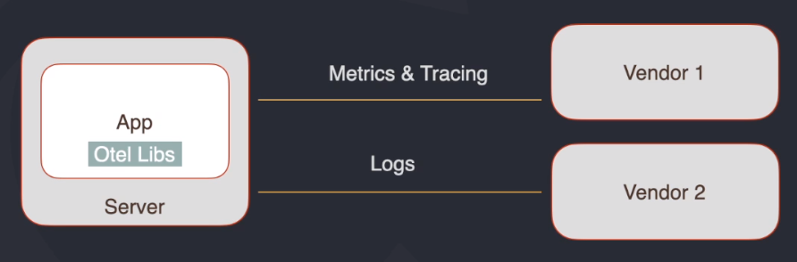
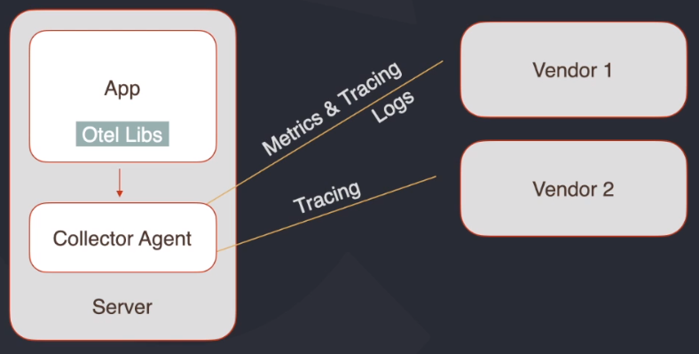
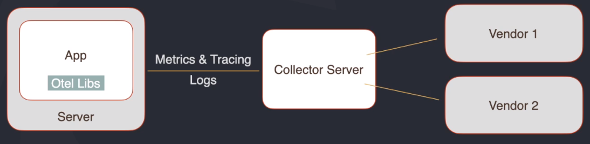

# Open Telemetry
Estratégia, composta por padrões, que permitem a aplicação ser agnóstica a vendors (Elastic, NewRelic, Instana, DataDog) utilizados para metricas, logs e trace.

## Agenda
- Contexto
- Projeto Open Telemetry
- Arquitetura
- Demo

## Contexto - Revisando Observabilidade

- Observabilidade
  - **Logs**: O que aconteceu no sistema
  - **Métricas**: Como/Quando/Quanto aconteceu
  - **Tracing** (Rastreamento): Onde aconteceu
  - (Cloud Native Telemetry)
- Centralização de Informação
- Necessidade de customização das informações
  - Geração de métricas de negócio
  - Tracing de rotinas e blocos internos da aplicação
- Vendors e Tools com padrões diferentes = Lock in

## OpenTracing + OpenCensus = OpenTelemetry
Padronização de Tracing, Logs e Metrics

O OpenTelemetry fornece um padrão de código aberto único e um conjunto de tecnologias para capturar e exportar métricas, traces e registros dos seus aplicativos e infraestrutura nativos da nuvem.

## O que é OpenTelemetry
- Framework de observabilidade para softwares cloud native
- Conjunto de ferramentas, APIs e SDKs
- Instrumentação, geração, coleta e exportação de dados de telemetria
- CNCF - Cloud Native Computing Foundation

## Componentes principais
- Especificações
  - Dados
  - SDKs
  - APIs
- Collector
  - Agente ou serviço
  - Pipeline
    - Recebimento
    - Processamento
    - Envio de dados
  - Vendor-agnostic
- Libs
  - Vendor-agnostic
  - Tracing & Logs
  - Auto tracing
- Logs: Draft

## Tipos de Collector

### Sem collector
Aplicação acessando vendors para enviar os dados

### Collector no modo Agente
Agente coletor como sidecar
Menor latencia

### Collector no modo server

## Instrumentação Manual vs Automatica
